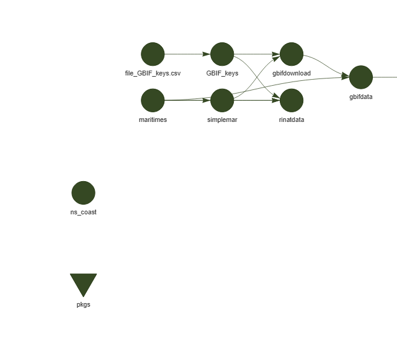
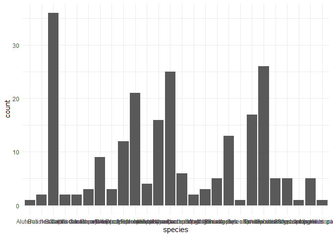
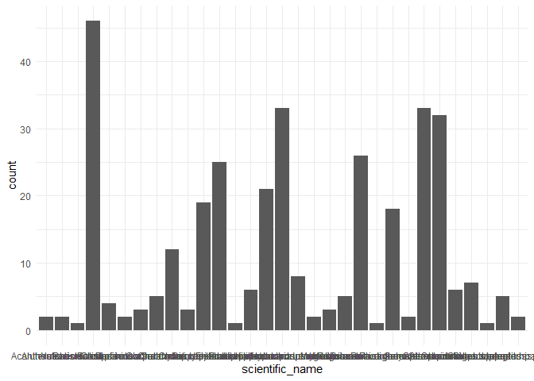
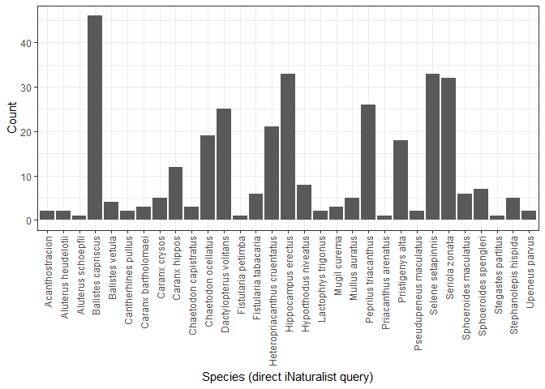
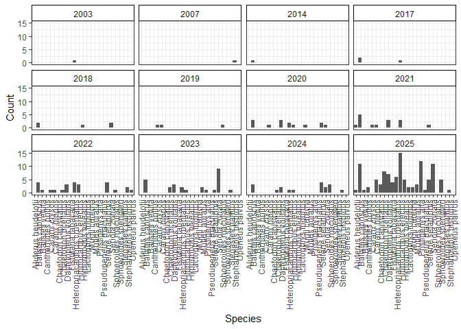
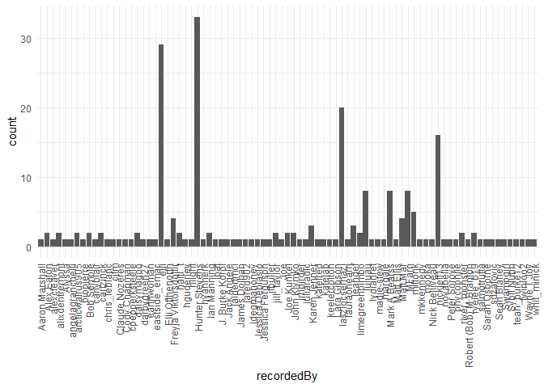
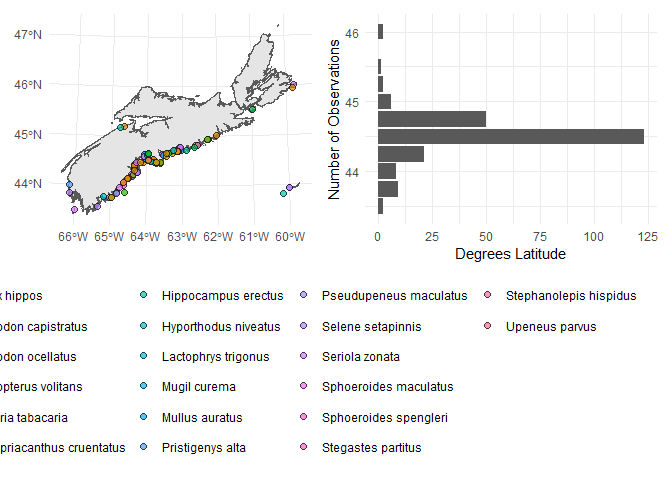
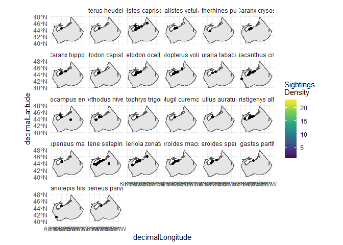

<!-- README.md is generated from README.Rmd. Please edit that file -->

# warmwaterfish

<!-- badges: start -->

<!-- badges: end -->

The goal of `warmwaterfish` is to look at the prevalence of warm-water
fish species in coastal Nova Scotia under climate change.

## Data Pipeline

The data pipeline is built using the `targets` package. We use `targets`
to avoid re-querying GBIF every time we want to run the script (i.e. it
will only re-query if we change the query it). For a quick tutorial on
targets, see Jaimie Harbin’s
[demo](https://github.com/AtlanticR/bioRworkshops/blob/master/22_targets/targets.Rmd)
or the targets [website](https://books.ropensci.org/targets/).

The main points to know are that the code for the pipeline is in
`_targets.R` and the data are stored in the `_targets/objects` folder.
To run the entire pipeline, just run `targets::tar_make()` in the R
console. To see the status of the pipeline, run
`targets::tar_visnetwork()`. To load the output of a target into your R
session, run `targets::tar_load(<target_name>)` or
`targets::tar_load_everything()`.

``` r
tar_load(c(gbifdata,rinatdata,inatdata,maritimes))
tar_visnetwork()
#> Loading required package: librarian
#> PhantomJS not found. You can install it with webshot::install_phantomjs(). If it is installed, please make sure the phantomjs executable can be found via the PATH variable.
#> file:///C:/Users/DaigleR/AppData/Local/Temp/1/RtmpATAYpZ/file6ae8bec7f9a/widget6ae832f124b8.html screenshot completed
```

<!-- -->

## Example Plots

Species counts:

``` r
ggplot(gbifdata)+
  geom_bar(aes(species))+
  xlab(label = "Species (all GBIF)")+
  ylab(label="Count")+
  theme_minimal()+
  theme(axis.text.x = element_text(angle = 90, hjust = 1, vjust=0.5))
```

<!-- -->

``` r

ggplot(inatdata)+
  geom_bar(aes(species))+
  xlab(label = "Species (iNaturalist via GBIF)")+
  ylab(label="Count")+
  theme_minimal()+
  theme(axis.text.x = element_text(angle = 90, hjust = 1, vjust=0.5))
```

<!-- -->

``` r

ggplot(rinatdata)+
  geom_bar(aes(scientific_name))+
  xlab(label = "Species (direct iNaturalist query)")+
  ylab(label="Count")+
  theme_bw()+
  theme(axis.text.x = element_text(angle = 90, hjust = 1, vjust=0.5))
```

<!-- --> Species by
year

``` r
ggplot(inatdata)+
  geom_bar(aes(species))+
  #rotate x-labels 90
  facet_wrap(~lubridate::year(eventDate))+
  xlab(label = "Species")+
  ylab(label="Count")+
  theme_bw()+
  theme(axis.text.x = element_text(angle = 90, hjust = 1, vjust=0.5), strip.background = element_rect(fill = "white", color = "black"))
```

<!-- -->

User contributions:

``` r
ggplot(inatdata)+
  geom_bar(aes(recordedBy))+
  #rotate x-labels 90
  theme_minimal()+
  theme(axis.text.x = element_text(angle = 90, hjust = 1, vjust=0.5))
```

<!-- -->

Spatial distribution of observations:

``` r
p1 <- ggplot(inatdata)+
  geom_bar(aes(round(decimalLatitude*4)/4))+
  coord_flip()+
  ylab(label = "Degrees Latitude")+
  theme_minimal()

p2 <- ggplot(maritimes)+
  geom_sf()+
  geom_sf(data= inatdata, aes(fill=species), color="black",shape=21, size=2, alpha=0.7)+
  theme_minimal()+
  theme(legend.position = "bottom")
p2 + p1
```

<!-- -->

Heatmap of observation density:

``` r

ggplot(maritimes) +
  geom_sf() +
  stat_sf_coordinates(data = inatdata) +
  geom_hex(data = inatdata, 
           aes(x = decimalLongitude, y = decimalLatitude), 
           alpha = 0.7, 
           bins = 30) +
  scale_fill_viridis_c(name = "Sightings\nDensity") +
  facet_wrap(~species) +
  theme_minimal()
```

<!-- -->
